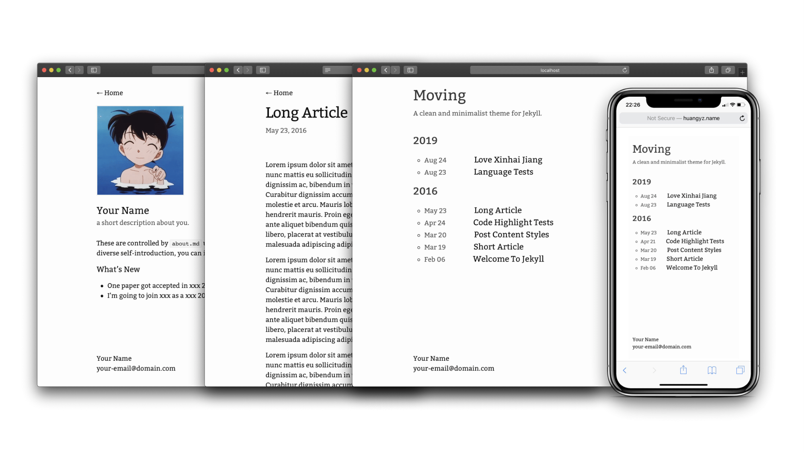

# moving

[](https://badge.fury.io/rb/moving) [](https://travis-ci.org/huangyz0918/moving)  

Moving is a clean and minimalist theme for [Jekyll](https://jekyllrb.com/), focuses on pure and efficient writing. [[view demo]](http://huangyz.name/moving/) 

Inspired by [Hugo](https://gohugo.io/) theme, [YinYang](https://github.com/joway/hugo-theme-yinyang).




## Installation

### New Blog
If you want to create a new blog using moving. You can follow these steps after setting up the [Jekyll](https://jekyllrb.com) environments:

Clone this repository: 
```bash
git clone https://github.com/huangyz0918/moving.git
```

Move into that directory:
```bash
cd moving/
```

Install required gems using `bundle`:
```bash
bundle install
```

Run the blog in localhost
```bash
jekyll serve
```

Once you successfully run the moving blog, you can modify the theme and add posts by yourself, have fun!

### Add Moving to an Existing Blog

Add this line to your Jekyll site's `Gemfile`:

```ruby
gem "moving"
```

And add this line to your Jekyll site's `_config.yml`:

```yaml
theme: moving
```

And then execute:

    $ bundle

Or install it yourself as:

    $ gem install moving

### Deploy to Github Pages

:warning: If you want to publish your site in [Github Pages](https://pages.github.com/). Change `theme: xxx` in `_config.yml` to `remote_theme: huangyz0918/moving` then push to your github repo (this is important, or you will get an error from github pages that not support the moving theme). If you want to test your site locally, you can change that to `theme: moving` and build again.

Here is an [example](https://github.com/huangyz0918/personal-page-blog) for Github Pages.

